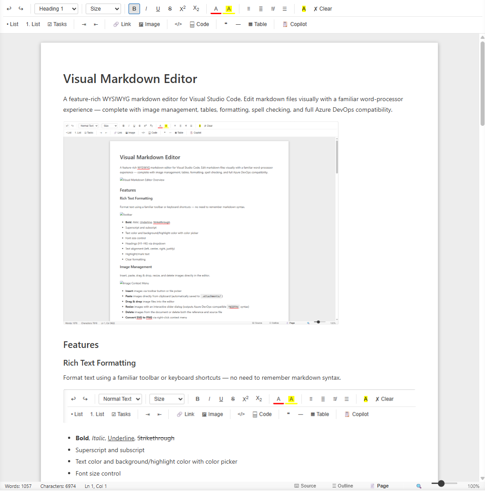
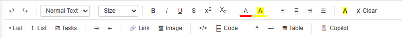
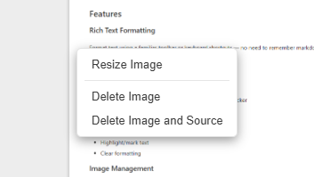

# Visual Markdown Editor

A feature-rich WYSIWYG markdown editor for Visual Studio Code. Edit markdown files visually with a familiar word-processor experience — complete with image management, tables, formatting, spell checking, and full Azure DevOps compatibility.

## Features

### Rich Text Formatting

Format text using a familiar toolbar or keyboard shortcuts — no need to remember markdown syntax.

-   **Bold**, *Italic*, <u>Underline</u>, ~Strikethrough~
-   Superscript and subscript
-   Text color and background/highlight color with color picker
-   Font size control
-   Headings (H1–H6) via dropdown
-   Text alignment (left, center, right, justify)
-   Highlight/mark text
-   Clear formatting

### Image Management

Insert, paste, drag & drop, resize, and delete images directly in the editor.

-   **Insert** images via toolbar button or file picker
-   **Paste** images directly from clipboard (automatically saved to `.attachments/`)
-   **Drag & drop** image files into the editor
-   **Resize** images with an interactive slider dialog (outputs Azure DevOps-compatible `=WIDTHx` syntax)
-   **Delete** images from the document or delete both the reference and source file
-   **Convert SVG to PNG** via right-click context menu
-   Supports PNG, JPG, GIF, SVG, WebP, BMP, ICO

### Tables

Create and edit tables with full context menu support.

-   Insert tables with configurable rows, columns, and optional header row
-   Right-click context menu to:
    -   Add/delete rows and columns
    -   Delete entire table
-   Full GFM (GitHub Flavored Markdown) table output

### Links

Insert and manage hyperlinks with a dedicated dialog.

-   Insert links with URL, display text, title, and "open in new tab" option
-   Right-click links to edit, copy URL, or remove the link
-   Keyboard shortcut: `Ctrl+K`

### Code Blocks

-   Inline code formatting
-   Fenced code blocks with language selection (JavaScript, TypeScript, Python, C#, Java, HTML, CSS, JSON, YAML, Bash, SQL, XML, Markdown, PowerShell, Terraform, and more)

### Lists & Tasks

-   Bullet lists and numbered lists
-   Task lists with interactive checkboxes
-   Indent/outdent support

### Spell Checking

Built-in spell checker with suggestions and custom dictionary support.

-   Underlines misspelled words
-   Right-click for correction suggestions
-   Add words to your personal custom dictionary (persists across sessions)

### Source View

Toggle between the visual WYSIWYG editor and raw markdown source at any time.

-   Switch with the **Source** button in the status bar
-   Edits in either view sync back to the file

### Document Outline

A navigation pane listing all headings in the document for quick jumping.

-   Toggle via the **Outline** button in the status bar
-   Click any heading to scroll to it

### Page Mode & Zoom

-   **Page Mode** — renders the document in a constrained page-width layout
-   **Zoom** — slider (50%–200%) or `Ctrl+Scroll` to zoom the editor (not available for SVG files)

### GitHub Copilot Integration

-   **Copilot Context** button opens a linked text editor so GitHub Copilot agents can read the document content and your selection
-   Selection in the visual editor syncs to the linked text editor

### Azure DevOps Compatibility

Outputs markdown fully compatible with Azure DevOps wikis:

-   Image paths use `/.attachments/` convention
-   Resized images use `` syntax (not `` tags)
-   GFM tables, task lists, and fenced code blocks

## Getting Started

### Installation

1.  Install the extension from the VS Code Marketplace (or install the `.vsix` file manually)
2.  Open any `.md`, `.markdown`, or `.mdown` file
3.  When prompted, choose **"Visual Markdown Editor"** as the editor, or right-click the file in Explorer → **"Open with Visual Markdown Editor"**

### Opening the Editor

There are several ways to open a markdown file in the visual editor:

| Method | How |
| --- | --- |
| File Explorer | Right-click a `.md` file → **Open with Visual Markdown Editor** |
| Command Palette | `Ctrl+Shift+P` → **Open with Visual Markdown Editor** |
| New Document | `Ctrl+Shift+P` → **Visual Markdown: New Document** |
| Reopen With | Click the editor mode indicator in the tab bar → choose Visual Markdown Editor |

### Keyboard Shortcuts

| Shortcut | Action |
| --- | --- |
| `Ctrl+B` | Bold |
| `Ctrl+I` | Italic |
| `Ctrl+U` | Underline |
| `Ctrl+K` | Insert link |
| `Ctrl+Z` | Undo |
| `Ctrl+Y` | Redo |
| `Ctrl+Scroll` | Zoom in/out |

### Working with Images

1.  **Insert from file:** Click the 🖼 Image toolbar button and select an image file
2.  **Paste from clipboard:** Copy an image (e.g., screenshot) and paste with `Ctrl+V`
3.  **Drag & drop:** Drag an image file from Explorer into the editor

Images are automatically saved to a `.attachments/` folder alongside your markdown file.

To **resize** an image, right-click it and choose **Resize Image**, then use the slider to set the desired width.

To **convert an SVG to PNG**, right-click the SVG image and choose **Convert to PNG**.

### Working with Tables

1.  Click the **⌬ Table** toolbar button
2.  Set the number of rows, columns, and whether to include a header row
3.  Click **Insert**
4.  Right-click any cell to add/remove rows and columns

## Azure DevOps Wiki Usage

This editor is designed to work seamlessly with Azure DevOps wiki repositories:

-   Clone your Azure DevOps wiki repo locally
-   Open the folder in VS Code
-   Edit `.md` files with the visual editor
-   Images are stored in `.attachments/` using the convention Azure DevOps expects
-   Resized images use the `` syntax that Azure DevOps renders correctly
-   Commit and push — your wiki pages will display correctly in Azure DevOps

## Requirements

-   VS Code 1.80.0 or later

## Known Limitations

-   SVG images cannot be resized (they are vector graphics with no fixed pixel dimensions) — use **Convert to PNG** first if you need a specific size
-   The spell checker uses a built-in English dictionary; other languages are not currently supported
-   Very large documents may experience slight input lag during spell checking

## Release Notes

### 0.1.4

-   Image resize now outputs Azure DevOps-compatible `` syntax
-   Removed resize option for SVG files
-   Zoom controls hidden for SVG file types

---

**Enjoy!** If you have feedback or find issues, please open an issue on the repository.